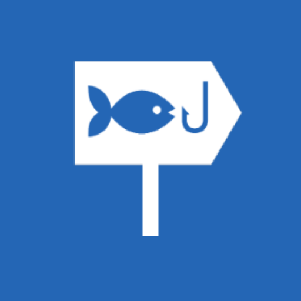
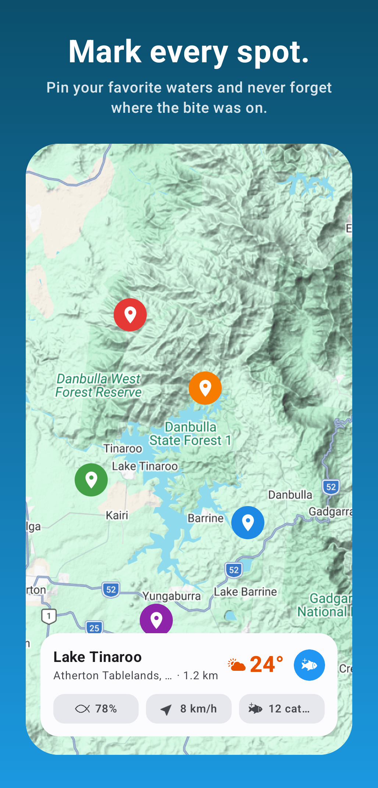
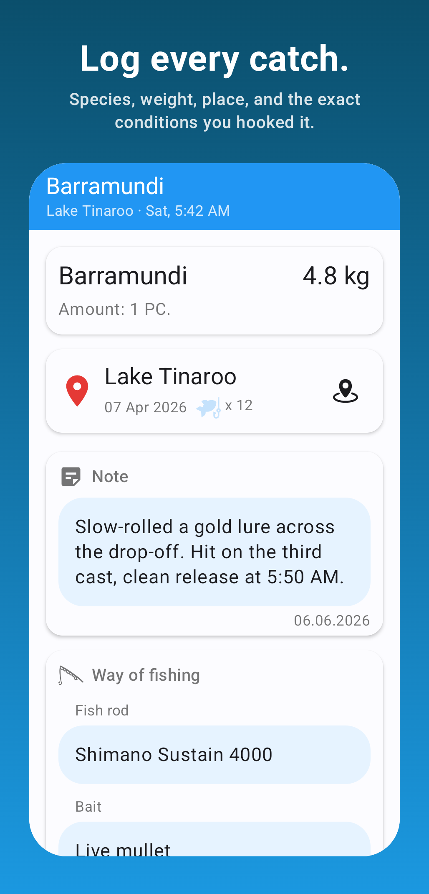
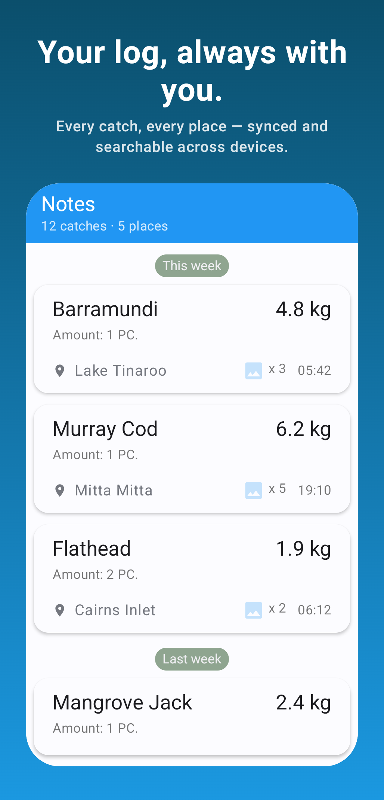
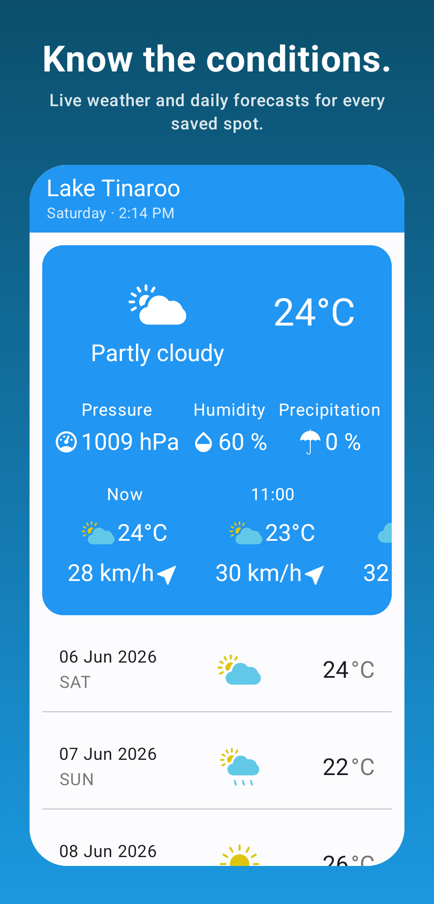

# Fishing Notes

**Your fishing log, always with you.** Mark your spots, log every catch with the conditions that hooked it, and check live weather before you head out.

<br clear="left"/>

<p>
  
  
  
</p>

---

<p align="center">
  
  
  
  
</p>

## Features

- 🗺️ **Save your spots** — drop custom-colored markers on any lake, river, or coastline.
- 🎣 **Log every catch** — species, weight, lure, photo, notes, and the exact weather you caught it in.
- 📒 **Browse your history** — every catch and place, sorted, filterable by species, spot, or date.
- 🌦️ **Know the conditions** — live weather and multi-day forecasts for every saved spot.
- ☁️ **Sync everywhere** — sign in once; your log follows you across devices.
- 📴 **Works offline** — keep logging with no signal; it syncs when you're back in range.

## Tech stack

A **Kotlin Multiplatform** app (Android + iOS) with a shared UI in **Compose Multiplatform**.

| Area | Stack |
|---|---|
| UI | Compose Multiplatform, Material 3 |
| DI | [Koin](https://insert-koin.io/) |
| Backend | [Firebase](https://firebase.google.com/) — Auth, Firestore, Storage, Analytics, Crashlytics |
| Networking | [Ktor](https://ktor.io/) client (weather via OpenWeatherMap) |
| Local DB | [Room](https://developer.android.com/jetpack/androidx/releases/room) (KMP) |
| Images | [Coil 3](https://coil-kt.github.io/coil/) |
| Maps | Google Maps (KMP) |
| Animations | [Compottie](https://github.com/alexzhirkevich/compottie) (Lottie) |
| Ads | Google AdMob |

## Project structure

```
shared/        # KMP module — commonMain / androidMain / iosMain
  commonMain/  # shared UI, domain, data, DI
  androidMain/ # Android-specific (maps, ads, theme, workers)
  iosMain/     # iOS-specific actuals
androidApp/    # Android application entry point
iosApp/        # iOS application entry point
docs/          # store listing, privacy & terms (GitHub Pages), store assets
```

## Build

Add your keys to `local.properties` / `secrets.properties` (`OPENWEATHER_KEY`, `MAPS_API_KEY`, `GOOGLE_WEB_CLIENT_ID`, and keystore signing config), then:

```bash
./gradlew :androidApp:assembleDebug        # Android debug build
./gradlew :androidApp:bundleRelease        # signed release bundle (.aab)
```

iOS builds from `iosApp/` in Xcode against the shared framework.

## Download

Launching soon on Google Play.

<a href="https://play.google.com/store/apps/details?id=com.merkost.fishingnotes" target="_blank">
  
</a>

## Privacy & terms

- [Privacy Policy](https://merkost.github.io/FishingNotes/privacy.html)
- [Terms of Service](https://merkost.github.io/FishingNotes/terms.html)

---

<sub>Made for anglers. Tight lines. 🎣</sub>
